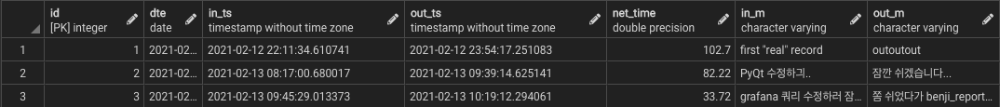
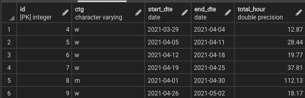

# db_schema.md

Benji 프로젝트에 쓰인 데이터베이스 테이블의 schema를 설명한다.

## 1. benji

근태 상태 (공부 상태)를 기록하는 테이블이다.



### Column descriptions

- id
- dte : 날짜
- in_ts : 공부 시작 시간
- out_ts : 공부 종료 시간
- net_time : 공부 시간 (minute)
- in_m : 공부 시작 시 입력 메세지
- out_m : 공부 종료 시 입력 메세지

### SQL

```sql
CREATE TABLE public.benji
(
    id integer NOT NULL GENERATED ALWAYS AS IDENTITY ( INCREMENT 1 START 1 MINVALUE 1 MAXVALUE 2147483647 CACHE 1 ),
    dte date,
    in_ts timestamp without time zone,
    out_ts timestamp without time zone,
    net_time double precision,
    in_m character varying COLLATE pg_catalog."default",
    out_m character varying COLLATE pg_catalog."default",
    CONSTRAINT benji_pkey PRIMARY KEY (id)
)
```

## 2. benji_backup

주간 & 월간 공부량을 주기적으로 백업하는 테이블이다. benji 테이블에서 쿼리를 통해 데이터를 갖고 온다.



### Column Description

- id
- ctg : category 를 뜻하며, 'w'이면 주간 요약 데이터, 'm'이면 월간 요약 데이터를 뜻한다.
- start_dte : 해당 데이터의 시작일
- end_dte : 해당 데이터의  종료일
- total_hour : 공부량 (hour)

### SQL

```sql
CREATE TABLE public.benji_backup
(
    id integer NOT NULL GENERATED ALWAYS AS IDENTITY ( INCREMENT 1 START 1 MINVALUE 1 MAXVALUE 2147483647 CACHE 1 ),
    ctg character varying COLLATE pg_catalog."default",
    start_dte date,
    end_dte date,
    total_hour double precision,
    CONSTRAINT benji_backup_pkey PRIMARY KEY (id)
)
```
