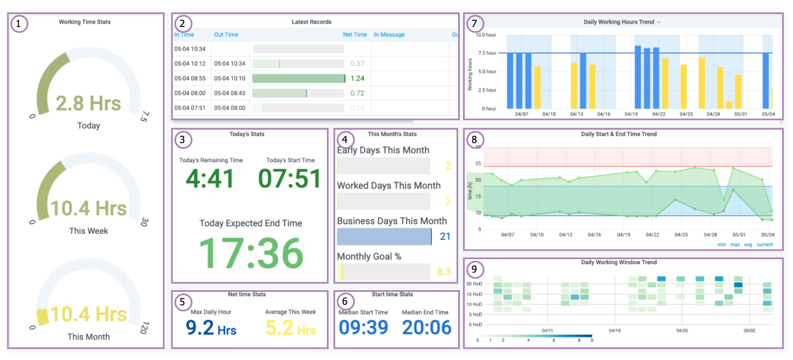
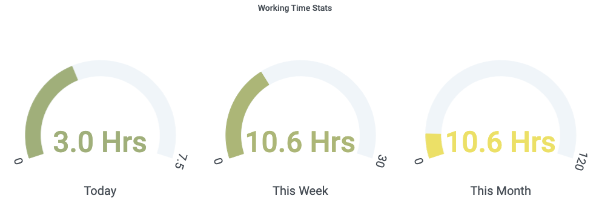
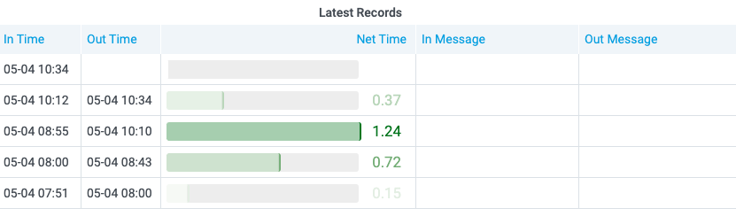
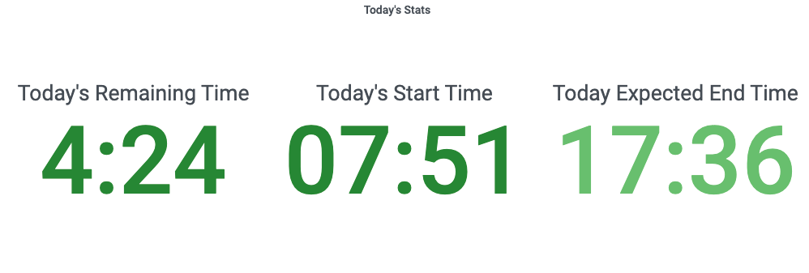
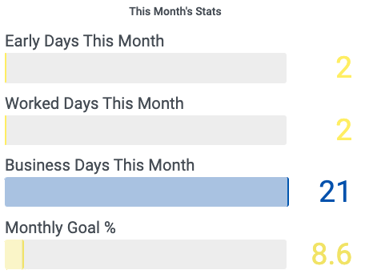
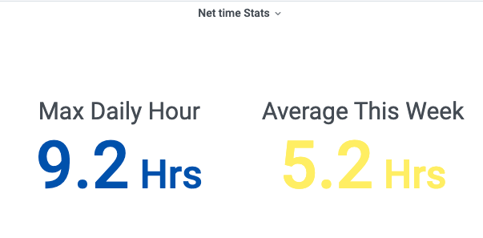
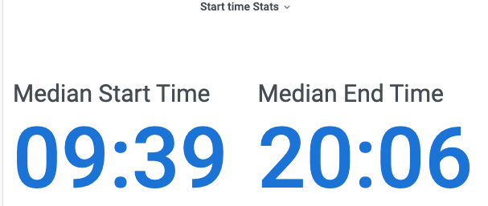
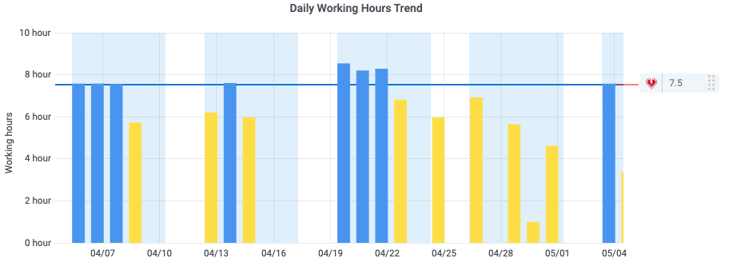
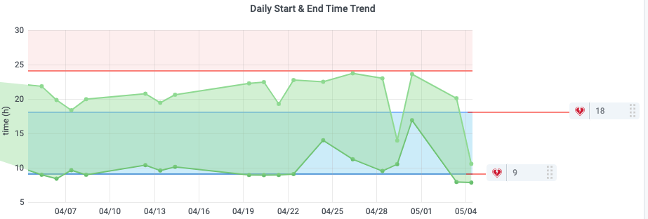
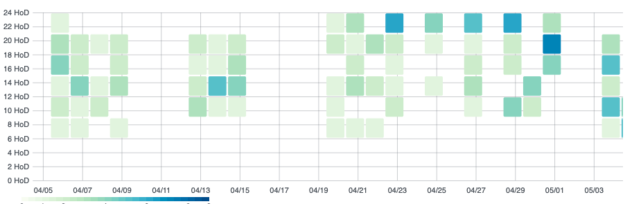

# grafana_queries.md

그라파나 쿼리를 정리한다.



총 9개의 주요 패널이 있다. 1\~6은 단순 통계, 7~9는 시계열 그래프이다. (9번은 실험중이다.)

## 1. Working Time Stats

지금까지 공부한 시간을 알려주는 패널이다. 각각 오늘, 이번 주, 이번 달 공부량을 실시간으로 시각화한다.



Grafana 설정에서 각 패널 그래프의 max는 스스로 정한 목표치로 설정한다

### 1.1 Today

```sql
WITH n AS
  (SELECT now() AT TIME ZONE 'ASIA/SEOUL' AS ts)
SELECT sum(net_time)/60 + CASE
						                 WHEN extract(epoch FROM max(out_ts) - max(in_ts)) < 0 OR max(out_ts) is null THEN (extract(epoch FROM (n.ts - max(in_ts))))/3600
                             ELSE 0
                          END AS daily_time
FROM benji,
     n
WHERE dte = n.ts::date
GROUP BY n.ts
```

### 1.2 This Week

```sql
WITH n AS
(
       SELECT Now() at time zone 'Asia/Seoul' AS ts)
SELECT   Sum(net_time)/60 +
         CASE
                  WHEN Extract(epoch FROM Max(out_ts) - Max(in_ts)) < 0 OR max(out_ts) is null THEN (Extract(epoch FROM (n.ts - Max(in_ts))))/3600
                  ELSE 0
         END AS weekly_time
FROM     benji,
         n
WHERE    dte BETWEEN Date_trunc('week', n.ts) AND      n.ts::date
GROUP BY n.ts
```

### 1.3 This Month

```sql
WITH n AS
(
       SELECT Now() at time zone 'Asia/Seoul' AS ts)
SELECT   Sum(net_time)/60 +
         CASE
                  WHEN Extract(epoch FROM Max(out_ts) - Max(in_ts)) < 0 OR max(out_ts) is null THEN (Extract(epoch FROM (n.ts - Max(in_ts))))/3600
                  ELSE 0
         END AS monthly_time
FROM     benji,
         n
WHERE    dte BETWEEN Date_trunc('month', n.ts) AND      n.ts::date
GROUP BY n.ts
```

## 2. Latest Records

DB TABLE에서 오늘자 기록만 보여주는 패널이다. 한번에 몇 시간이나 집중했는지 알 수 있다.



```sql
SELECT   To_char(in_ts, 'mm-dd HH24:MI')  AS in_ts,
         To_char(out_ts, 'mm-dd HH24:MI') AS out_ts,
         net_time/60                      AS net_time,
         in_m,
         out_m
FROM     benji
WHERE    dte = (Now() at time zone 'Asia/Seoul')::date
ORDER BY in_ts DESC limit 10
```

## 3. Today's Stats

오늘의 시작 시간, 남은 시간, 예상 종료 시간을 알려주는 패널이다.



### 3.1 Todays' Remaining Time

하루 목표치를 기준으로 오늘의 남은 공부 시간을 HH:MM 형태로 시각화한다. 목표치를 달성하면 "GOAL"을 리턴한다.

```sql
WITH n AS
  (SELECT now() AT TIME ZONE 'ASIA/SEOUL' AS ts)
SELECT CASE
           WHEN daily.rest <= 0 THEN ('GOAL')
           ELSE concat(floor(daily.rest), ':', LPAD(round((daily.rest - floor(daily.rest))*60)::text, 2, '0'))
       END AS to_daily_goal
FROM
  (SELECT 7.5 - (sum(net_time)/60 + CASE
                                        WHEN max(out_ts) < max(in_ts)
                                             OR max(out_ts) IS NULL THEN (extract(epoch
                                                                                  FROM (n.ts - max(in_ts))))/3600
                                        ELSE 0
                                    END) AS rest
   FROM benji,
        n
   WHERE dte = n.ts::date
   GROUP BY n.ts) AS daily
```

### 3.2 Today's Start Time

오늘의 시작 시간을 알려준다.

```sql
SELECT to_char(min(in_ts), 'HH24:MI') AS today_start
FROM benji
WHERE dte = (now() AT TIME ZONE 'ASIA/SEOUL')::date
```

### 3.3 Todays' Expected Ending Time

오늘의 예상 종료 시간을 알려주는 패널이다. 쿼리가 많이 길어졌고(..) 아직 보완 중이지만 기본적인 논리는 다음과 같다.

- 12~1시, 5~6시는 식사 시간으로 감안하여 종료 시간에 추가 계산
- 오늘 남은 시간 ≤ 이번 주 남은 시간 일시, 오늘 남은 시간 기준으로 리턴
- 오늘 남은 시간 > 이번 주 남은 시간 일시, 이번 주 남은 시간 기준으로 리턴
- min(오늘 남은 시간, 이번주 남은 시간) 일시 "GOAL" 리턴

```sql
WITH n AS
  (SELECT Now() AT TIME ZONE 'ASIA/SEOUL' AS ts),
     weekly AS
  (SELECT 30 - (Sum(net_time)/60 + CASE
                                       WHEN max(out_ts) < max(in_ts)
                                            OR max(out_ts) IS NULL THEN (Extract(epoch
                                                                                 FROM (n.ts - Max(in_ts))))/3600
                                       ELSE 0
                                   END) AS weekly_rest
   FROM benji,
        n
   WHERE dte BETWEEN Date_trunc('week', n.ts) AND n.ts::date
   GROUP BY n.ts),
     daily AS
  (SELECT 7.5 - (sum(net_time)/60 + CASE
                                        WHEN max(out_ts) < max(in_ts)
                                             OR max(out_ts) IS NULL THEN (extract(epoch
                                                                                  FROM (n.ts - max(in_ts))))/3600
                                        ELSE 0
                                    END) AS daily_rest
   FROM benji,
        n
   WHERE dte = n.ts::date
   GROUP BY n.ts)
SELECT CASE
           WHEN d.rest < 0 THEN 'Goal'
           ELSE concat(floor(d.today_end), ':', LPAD(round((d.today_end - floor(d.today_end))*60)::text, 2, '0'))
       END AS expected_end
FROM
  (SELECT CASE
              WHEN c.now_h < 12 THEN c.now_h + c.now_m + c.rest + 2
              WHEN c.now_h >= 12
                   AND c.now_h < 17 THEN c.now_h + c.now_m + c.rest + 1
              WHEN c.now_h >= 17 THEN c.now_h + c.now_m + c.rest
          END AS today_end,
          c.rest AS rest
   FROM
     (SELECT CASE
                 WHEN weekly_rest < 7.5 THEN weekly_rest
                 ELSE daily_rest
             END AS rest,
             extract(HOUR
                     FROM n.ts) AS now_h,
             extract(MINUTE
                     FROM n.ts)/60 AS now_m
      FROM n,
           weekly,
           daily) AS c) AS d
```

## 4. This Month's Stats

이번 달 일찍 시작한 날, 공부한 날, 평일 수, 월간 목표량 달성률 퍼센트를 실시간으로 보여주는 패널이다.



### 4.1 Early Days This Month

이번 달 기준으로 지금까지 일찍 시작한 날 수를 리턴한다. ("일찍 시작"의 기준은 스스로 설정한다. 나의 경우는 9시 전 시작으로 잡았다.)

```sql
WITH n AS
  (SELECT now() AT TIME ZONE 'ASIA/SEOUL' AS ts)
SELECT count(DISTINCT a.dte) AS early_d
FROM
  (SELECT dte,
          min(in_ts) AS start_time
   FROM benji,
        n
   WHERE dte BETWEEN date_trunc('month', n.ts) AND n.ts::date
   GROUP BY dte) AS a
WHERE extract(HOUR
              FROM start_time) < 9
```

### 4.2  Worked Days This Month

이번 달에 공부한 날, 즉 기록이 있는 날의 수를 리턴한다.

```sql
WITH n AS
  (SELECT now() AT TIME ZONE 'ASIA/SEOUL' AS ts)
SELECT count(DISTINCT dte) AS worked_d
FROM benji,
     n
WHERE dte BETWEEN date_trunc('month', n.ts) AND n.ts::date
```

### 4.3 Business Days This Month

이번 달 평일 수를 리턴한다.(공휴일은 감안하지 않았다)

```sql
WITH days AS
  (SELECT dd,
          extract(DOW
                  FROM dd) dw
   FROM generate_series(cast(date_trunc('month', now() AT TIME ZONE 'ASIA/SEOUL') AS date), (date_trunc('MONTH', now() AT TIME ZONE 'ASIA/SEOUL') + INTERVAL '1 MONTH - 1 day')::date, '1 day'::interval) dd)

   select count(dd) AS business_days
from   days
where  dw not in (6,0);
```

### 4.4 Monthly Goal %

월간 목표량 달성률을 퍼센티지로 보여준다. 월간 목표량은 일간 목표시간 * 평일 수 로 계산한다.

```sql
WITH n AS
  (SELECT now() AT TIME ZONE 'ASIA/SEOUL' AS ts),
     days AS
  (SELECT dd,
          extract(DOW
                  FROM dd) dw
   FROM generate_series(cast(date_trunc('month', now() AT TIME ZONE 'ASIA/SEOUL') AS date), (date_trunc('MONTH', now() AT TIME ZONE 'ASIA/SEOUL') + INTERVAL '1 MONTH - 1 day')::date, '1 day'::interval) dd)
SELECT (monthly_time / (count(dd)*6)) * 100 AS goal_perc
FROM days,

  (SELECT Sum(net_time)/60 + CASE
                                 WHEN Extract(epoch
                                              FROM Max(out_ts) - Max(in_ts)) < 0
                                      OR max(out_ts) IS NULL THEN (Extract(epoch
                                                                           FROM (n.ts - Max(in_ts))))/3600
                                 ELSE 0
                             END AS monthly_time
   FROM benji,
        n
   WHERE dte BETWEEN Date_trunc('month', n.ts) AND n.ts::date
   GROUP BY n.ts) AS A
WHERE dw not in (6,0)
GROUP BY A.monthly_time
```

## 5. Net time Stats

일일 공부량에 관한 통계를 보여준다.



### 5.1 Max Daily Hour

이제까지 가장 오래 공부 했던 날의 공부량을 알려준다.

```sql
SELECT Sum(net_time) / 60 AS max_daily_hour
FROM   benji
GROUP  BY dte
ORDER  BY Sum(net_time) DESC
LIMIT  1
```

### 5.2 Average This Week

이번 주의 일 평균 공부량을 알려준다.

```sql
SELECT Sum(net_time) / 60 AS max_daily_hour
FROM   benji
GROUP  BY dte
ORDER  BY Sum(net_time) DESC
LIMIT  1
```

## 6. Start time stats



지금까지 데이터를 바탕으로 공부 시작 및 종료 시간의 중간값을 알려준다. 가끔 튀는 값들이 있어 (밤에 뭐가 생각나서 갑자기 켜는 경우..) 평균이 아닌 중간값으로 설정하였다.

```sql
SELECT Percentile_disc(0.5)
         within GROUP ( ORDER BY daily.first_hour ) AS median_start_time,
       Percentile_disc(0.5)
         within GROUP ( ORDER BY daily.last_hour )  AS median_end_time
FROM   (SELECT To_char(Min(in_ts), 'HH24:MI')  AS first_hour,
               To_char(Max(out_ts), 'HH24:MI') AS last_hour
        FROM   benji
        GROUP  BY dte) AS daily
```

## 7. Daily Working Hours Trend

일일 공부량의 추이를 보여준다.



하루 목표치를 threshold로 설정하였고, 목표 달성한 날은 파란색, 달성 못한 날은 노란색으로 표시하였다. Grafana에서는 bar graph의 값에 따라 색깔을 다르게 설정하는 기능이 없는 것 같다. 그래서 부득이하게 비슷한 쿼리를 2개 설정하고 변수명으로 색깔을 입히는 편법(?)을 썼다. 목표 달성한 날은 daily_hour_ge (greater or equal), 달성하지 못한 날은 daily_hour_lt (less than) 으로 변수명을 주었디.

평일을 time regions으로 설정하여 하늘색으로 표시하였다.

### 7.1 daily_hour_ge

일일 목표치보다 많거나 같은 날의 데이터만 리턴하는 쿼리이다. 지난 데이터 및 오늘 현재 진행중인 공부량도 실시간으로 시각화에 반영한다.

```sql
WITH n AS
  (SELECT now() AT TIME ZONE 'ASIA/SEOUL' AS ts),
     td AS
  (SELECT dte,
          sum(net_time)/60 + CASE
                                 WHEN extract(epoch
                                              FROM max(out_ts) - max(in_ts)) < 0
                                      OR max(out_ts) IS NULL THEN (extract(epoch
                                                                           FROM (n.ts - max(in_ts))))/3600
                                 ELSE 0
                             END AS daily_time
   FROM benji,
        n
   GROUP BY dte,
            n.ts)
SELECT td.dte AS "time",
       td.daily_time AS daily_hour_gt
FROM td,
     n
WHERE td.daily_time >= 7.5
ORDER BY "time"
```

### 7.2 daily_hour_lt

일일 목표치보다 적은 날의 데이터만 리턴하는 쿼리이다. 부등호와 변수명을 제외하고 위 쿼리와 동일하다.

```sql
WITH n AS
  (SELECT now() AT TIME ZONE 'ASIA/SEOUL' AS ts),
     td AS
  (SELECT dte,
          sum(net_time)/60 + CASE
                                 WHEN extract(epoch
                                              FROM max(out_ts) - max(in_ts)) < 0
                                      OR max(out_ts) IS NULL THEN (extract(epoch
                                                                           FROM (n.ts - max(in_ts))))/3600
                                 ELSE 0
                             END AS daily_time
   FROM benji,
        n
   GROUP BY dte,
            n.ts)
SELECT td.dte AS "time",
       td.daily_time AS daily_hour_lt
FROM td,
     n
WHERE td.daily_time < 7.5
ORDER BY "time"
```

## 8. Daily Start & End Time Trend

일일 공부 시작 시간 & 종료 시간의 추이를 보여주는 그래프이다.



Time Region 설정을 통해 9시~6시는 파란색으로, 자정 이후의 시간대는 빨간색으로 표시하였다. 가급적 9to6 내에 공부하고 밤늦게 공부하지 말자는 취지이다. 만약 5월 1일 23:00에 시작해서 5월 2일 01:00에 끝내더라도 5월 1일의 종료시간으로 파악하도록 쿼리를 조정했다.

```sql
SELECT b.time,
       b.first_hour AS first_hour,
       CASE
           WHEN b.last_hour < b.first_hour THEN b.last_hour+24
           ELSE b.last_hour
       END AS last_hour
FROM
  (SELECT dte AS "time",
          (extract(HOUR
                   FROM a.start_time) + extract(MINUTE
                                                FROM a.start_time)/60)::numeric AS first_hour,
          (extract(HOUR
                   FROM a.end_time) + extract(MINUTE
                                              FROM a.end_time)/60)::numeric AS last_hour
   FROM
     (SELECT dte,
             min(in_ts) AS start_time,
             max(out_ts) AS end_time
      FROM benji
      GROUP BY dte) AS a) AS b
ORDER BY 1
```

## 9. Daily Working Window Trend (Beta)

실제 집중도를 시각화 하고 싶었는데 보완중이다.



 아래 쿼리를 time series로 놓고 heatmap 설정을 하면 뭔가 일별로 공부모드 돌입했다 나갔다가 하는 시간대가 찍히는데, 내가 생각한 것만큼 유용한 정보는 전달하지 못하는 듯 하다.

```sql
SELECT dte                                                              AS
       "time",
       ( Extract(hour FROM in_ts) + Extract(minute FROM in_ts) / 60 )   AS
       start_hour,
       ( Extract(hour FROM out_ts) + Extract(minute FROM out_ts) / 60 ) AS
       end_hour
FROM   benji
```
