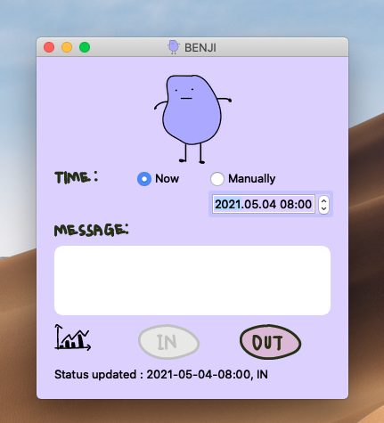
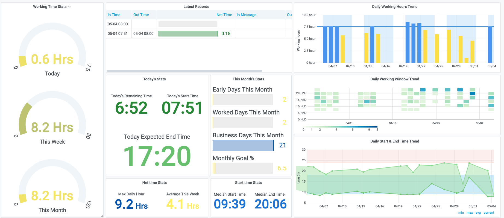
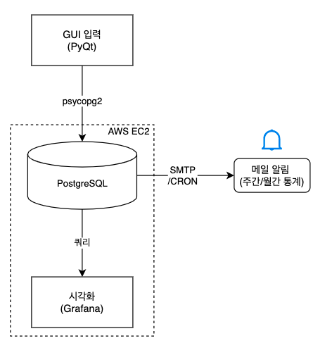
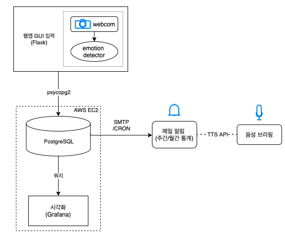

# PROJECT BENJI

### Concept

셀프 근태 관리 프로그램.

GUI을 통해 공부 상태를 기록하고, 목표 달성률과 각종 통계를 실시간 시각화 GUI와 보고서를 통해 확인할 수 있다.  

편의를 위해 "공부"로 총칭하였으나, 취준 & 프리랜서 작업 등 스스로 근태 통제가 필요한 다양한 케이스에 적용할 수 있다.

### Motive

나는 해야 할 일을 미루는 것에 전문이다. 맘먹고 할일을 시작하는 데 저어어어엉말 시간이 많이 걸린다. 이 문제는 코로나 시국 + 혼자 공부하면서 좀더 심각해졌고, 어떻게 스스로에게 동기부여 할 수 있을까 고민하다가 모바일 게임에서 아이디어를 얻었다.

"꿈의 정원", "탭탭피쉬 어비스리움" 이런 단순한 모바일 게임을 해본 적 있는가? 모바일 게임에선 별거 아닌 것에 엄청난 의미 부여를 하며 보상을 준다. "접속 시간", "클릭 수" 이런 1도 의미 없는 행동을 굳이 화려한 게이지와 효과로 시각화하면서 이용자에게 게임을 계속 할 동기를 부여한다. 그리고 그건 엄청 잘 먹힌다! 아무리 별거 아닌거라도 실시간으로 달성률이 "눈에 보이고", 그에 따라 "보상을 주면" 존잼 꿀잼이 되는 것이다.

그래서 나는 이걸 내 공부에 적용해보기로 했다. 스스로 일간, 월간 목표 시간을 정하고, 그 달성률을 실시간으로 시각화 하며, 달성률에 따라 월말에 시간당 금액을 산정하여 나에게 보상을 주는 것이다. (물론 내 통장에서.. from me to me..)

이름은 "시간이 돈이다" 라는 명언을 남긴 벤자민 프랭클린의 이름에서 따왔다.

### Screenshots



공부 상태를 기록하는 GUI



Grafana를 이용한 통계 대시보드

### Major Functions

- 오늘 & 이번 주 & 이번 달 공부량 및 목표 달성률 실시간 확인
- 오늘 남은 공부량 및 (식사 시간을 감안한) 예상 종료 시간 실시간 확인
- 지금까지 일일 공부 시작 시간, 종료 시간 등 추이 실시간 확인
- 매달 말에 해당 월 통계 보고서를 메일로 자동 전송

### Minor Functions

- 매주 일요일, 매월 말일마다 주간 & 월간 통계를 DB에 따로 백업하여 혹시 모를 데이터 유실을 방지한다.
- Grafana의 Threshold 기능을 이용해서, 오래 공부할 수록 시각화 GUI가 색상적으로 화려해지게 만든다.
- 월 n시간 달성 이상시 1.1배, 아침 9시 이전 시작시 1000원 추가 등 다양한 보상 체계로 월말에 랜덤박스 까는 두근두근함을 만든다.

### Languages & Tools

- Python
- PostgreSQL
- Grafana
- psycopg2
- AWS EC2
- SMTP
- Crontab
- PyQt

### Architecture




### File Structure

- readme.md (현위치) : 전체 프로젝트 설명
- benji.py : GUI (PyQt) 소스코드
- send_reports.py : 월간 보고서 전송하는 smtp 소스코드
- weekly_data_backup.py : 주간 데이터를 DB에 백업하는 소스코드
- grafana_queries.md : Grafana 및 패널 설명

send_reports.py도 AWS 위에 올라가 있다. 해당 파일을 주기적으로 실행하는 CRON은 다음과 같다.

```shell
##### EVERY MONTH #####

# last day of the month, send monthly benji report
0 14 30 4,6,9,11        * python3 send_reports.py
0 14 31 1,3,5,7,8,10,12 * python3 send_reports.py
0 14 28 2               * python3 send_reports.py


##### EVERY WEEK #####

0 14 * * SUN python3 send_reports.py
```


### Is it working?

이 프로그램을 처음 만든지 어연 3개월 정도가 지났는데 의외로 효과가 있었다.

- 일찍 일어나는 것에 보상을 걸면서, 책상 앞에 좀더 일찍 않게 됨.
- 의식적으로 목표량을 채우려고 하면서 시간 관리를 좀더 잘하게 됨.
- 노트북을 켜고 있을 때, 딴 짓을 길게 안하게 됨.
- 뭔가 공부를 하고 있어도 불안한 마음이 들때, 지난 통계를 보면서 안정감을 얻음. (그래도 열심히는 해왔군..)

### Things to Improve

- PyQt를 맥에서 앱형태로 만드는 과정에 계속 실패하고 있다. 껍데기를 다 만들어도 실행이 안된다.
- DB Schema나 SQL을 좀더 깔끔하게 정리할 수 있을 것 같다. 코드 리뷰나 피드백을 받을 수 있으면 좋겠지만, 현재 상황에서는 일단 관련 강의를 들으며 정돈하고 있다.
- 아이콘을 보라색 감자가 아니라 원숭이로 바꿀 생각이다. 이 아이디어는 사실 한 테드 토크에서 얻었는데, 할일을 미루는 사람의 머릿속에는 "즉각 만족 원숭이"가 있어서 합리적인 결정을 방해한다는 개념이다.

    [TED TALK : Inside the mind of a master procrastinator | Tim Urban](https://www.youtube.com/watch?v=arj7oStGLkU)

### Future Requirements

앞으로 추가하고 싶은 기능들은 다음과 같다.

- 웹앱 전환 : 모바일로 접근 가능하다는 장점과 기타 안정성 을위해 전환하려고 했지만. flask의 장벽에서 막혔다. 웹은 아직 나에게 너무나 먼 분야이다..
- "웃으면서 출근합시다" 기능 : 아침 9시에 노트북 캠으로 셀카를 찍어서, emotion detector가 "happy"라고 판정해야만 프로그램이 작동하는 아이디어. 나중에 어떻게든 웃으려고 노력하는 피곤한 얼굴 사진들을 한꺼번에 저장해서 보면 재밌을 것 같았다.
- 월말 보고서 음성 브리핑 : TTS API를 통해서, 월말 보고서를 음성으로 읽어주는 아이디어. 그냥 개인 비서 둔 느낌 내고 싶었다.
- 모닝 가챠 : 특정 시간(ex- 아침 8시) 전에 프로그램을 실행시키면 랜덤 박스가 뜬다. 오픈하면 그날 그날마다 다른 보상을 얻을 수 있다. (해당 월 보상 만원 추가 ,꽝 등..) 모바일 게임의 가챠에서 아이디어를 얻어서, 좀더 일찍 일어나려는 동기부여를 하려는 시도였다.

정말 초기 계획은 매 월말에 자동으로 내 통장에 보상 금액이 이체되게 하는 기능이었다. (from me to me...) 해당 기능은 아마 오픈 뱅킹 API 쪽에 가깝지 않을까 싶다.



### External Link

- Github
- Blog
